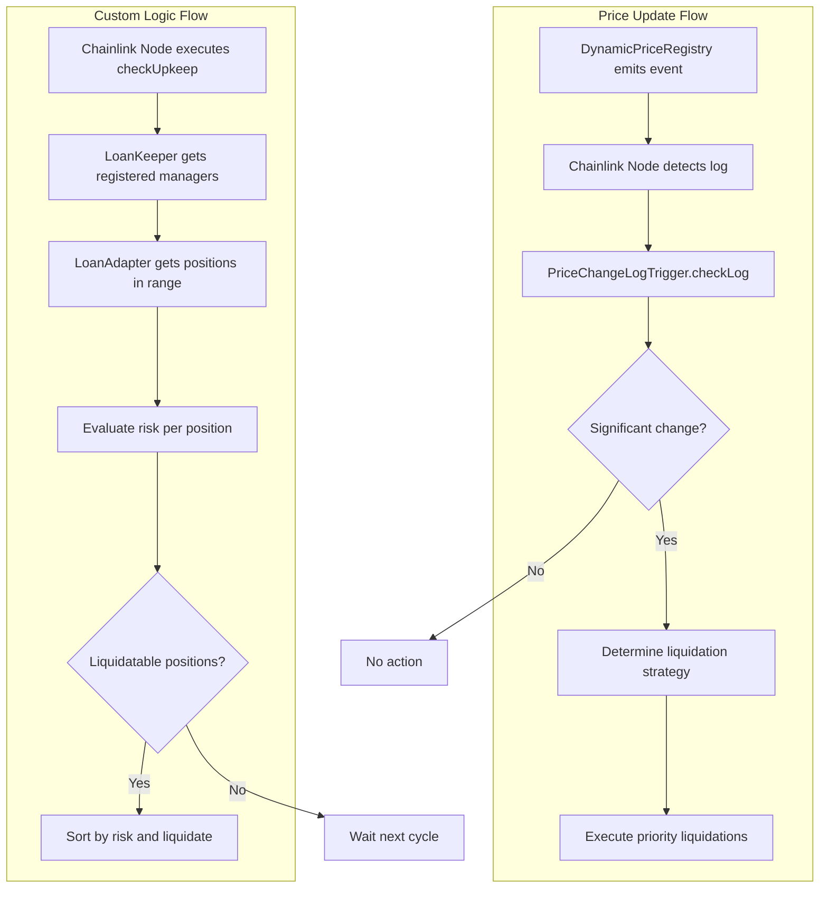

# 🤖 Advanced Chainlink Automation System

## 🚀 Overview

Complete automation system using **Chainlink Automation v2.25.0** with support for [`FlexibleLoanManager`](../core/FlexibleLoanManager.sol), [`DynamicPriceRegistry`](../core/DynamicPriceRegistry.sol) and intelligent automated liquidations. The system implements both **Custom Logic Automation** and **Log Trigger Automation** for maximum efficiency.

## 🌐 Deployed Contracts - Avalanche Fuji

| Contract | Address | Block Explorer |
|----------|---------|----------------|
| **[Automation Keeper](core/LoanAutomationKeeperOptimized.sol)** | `0x328433a99f182a80341946b2d8379e6df548234b` | [View on Snowtrace](https://testnet.snowtrace.io/address/0x328433a99f182a80341946b2d8379e6df548234b) |
| **[Loan Adapter](core/LoanManagerAutomationAdapter.sol)** | `0xca2cc8a23f1950bc2610187ac00615dc285362ac` | [View on Snowtrace](https://testnet.snowtrace.io/address/0xca2cc8a23f1950bc2610187ac00615dc285362ac) |
| **[Price Trigger](core/PriceChangeLogTrigger.sol)** | `0x96b1b83df95da5dd0c81cfd30e4d0d83b54ab3ff` | [View on Snowtrace](https://testnet.snowtrace.io/address/0x96b1b83df95da5dd0c81cfd30e4d0d83b54ab3ff) |
| **[FlexibleLoanManager](../core/FlexibleLoanManager.sol)** | `0x99681e9d661b5432BC3f989A109804b9932941fF` | [View on Snowtrace](https://testnet.snowtrace.io/address/0x99681e9d661b5432BC3f989A109804b9932941fF) |
| **[VaultBasedHandler](../core/VaultBasedHandler.sol)** | `0x23c794293569BC293bb0BaBfc96F89600182c7dd` | [View on Snowtrace](https://testnet.snowtrace.io/address/0x23c794293569BC293bb0BaBfc96F89600182c7dd) |
| **[FlexibleAssetHandler](../core/FlexibleAssetHandler.sol)** | `0x06FBe093ecD740Bb6c7928E178b7Fc8E6f916520` | [View on Snowtrace](https://testnet.snowtrace.io/address/0x06FBe093ecD740Bb6c7928E178b7Fc8E6f916520) |

### 📋 Contract Descriptions

| Contract | Main Function | Type |
|----------|---------------|------|
| **[Automation Keeper](core/LoanAutomationKeeperOptimized.sol)** | Main liquidation executor | Custom Logic Automation |
| **[Loan Adapter](core/LoanManagerAutomationAdapter.sol)** | Interface with [`FlexibleLoanManager`](../core/FlexibleLoanManager.sol) | Adapter Contract |
| **[Price Trigger](core/PriceChangeLogTrigger.sol)** | Automatic response to price changes | Log Trigger Automation |
| **[FlexibleLoanManager](../core/FlexibleLoanManager.sol)** | Core lending protocol with ultra-flexible ratios | Core Protocol |
| **[VaultBasedHandler](../core/VaultBasedHandler.sol)** | Handles vault-based assets (ETH, WBTC, USDC) | Asset Handler |
| **[FlexibleAssetHandler](../core/FlexibleAssetHandler.sol)** | Universal handler for mintable/burnable assets | Asset Handler |

### 🔗 Network & Links

- **Network**: Avalanche Fuji Testnet
- **Explorer**: [Snowtrace Testnet](https://testnet.snowtrace.io/)
- **RPC**: `https://api.avax-test.network/ext/bc/C/rpc`
- **Chain ID**: `43113`


### 🔗 Network & Links

- **Network**: Avalanche Fuji Testnet
- **Explorer**: [Snowtrace Testnet](https://testnet.snowtrace.io/)
- **RPC**: `https://api.avax-test.network/ext/bc/C/rpc`
- **Chain ID**: `43113`

## 🏗️ System Architecture

### Main Components

### 1. **LoanAutomationKeeperOptimized** ⚡ 
**Function**: Main Keeper (Custom Logic Automation)
- **Location**: `src/automation/core/LoanAutomationKeeperOptimized.sol`
- **Purpose**: Executes liquidations based on custom logic
- **Features**:
  - Extends `AutomationCompatible` (automatic UI detection)
  - Internal registration of loan managers with priorities
  - Gas-optimized batch processing
  - Risk level prioritization
  - Cooldown between liquidations
  - Integrated performance metrics

### 2. **LoanManagerAutomationAdapter** 🔗
**Function**: Adapter for [`FlexibleLoanManager`](../core/FlexibleLoanManager.sol)
- **Location**: `src/automation/core/LoanManagerAutomationAdapter.sol`
- **Purpose**: Interface between automation and lending protocol
- **Features**:
  - Implements `ILoanAutomation` interface
  - Efficient tracking of active positions
  - Dynamic risk assessment
  - Direct integration with [`FlexibleLoanManager`](../core/FlexibleLoanManager.sol)

### 3. **PriceChangeLogTrigger** 📈
**Function**: Price event-based trigger (Log Automation)
- **Location**: `src/automation/core/PriceChangeLogTrigger.sol`
- **Purpose**: Immediate response to price changes
- **Features**:
  - Uses official Chainlink `ILogAutomation` interface
  - Internal registration of loan managers with priorities
  - Real-time volatility detection
  - Multiple urgency levels (4 levels)
  - Temporary volatility mode
  - Direct integration with [`DynamicPriceRegistry`](../core/DynamicPriceRegistry.sol)

## 🔄 Detailed Workflow

### Technical System Analysis

The automation system implements two types of Chainlink v2.25.0 triggers:

1. **Custom Logic Automation**: Scheduled cyclic execution to verify positions
2. **Log Trigger Automation**: Reactive execution based on price events

#### Current System Architecture

The current system works as follows:

- **LoanAutomationKeeperOptimized**: Manages its own registry of loan managers with `registeredManagers` and `managersList`
- **PriceChangeLogTrigger**: Maintains its own list of loan managers with `registeredLoanManagers` and `loanManagersList`  
- **LoanManagerAutomationAdapter**: Implements `ILoanAutomation` and connects directly with [`FlexibleLoanManager`](../core/FlexibleLoanManager.sol)
- **Official Interfaces**: Uses `AutomationCompatible` and `ILogAutomation` from Chainlink v2.25.0

### Custom Logic Automation Cycle

### Log Trigger Automation Cycle

### Technical Implementation Details

#### 1. **LoanAutomationKeeperOptimized** - Code Analysis

```solidity
// 📍 src/automation/core/LoanAutomationKeeperOptimized.sol
contract LoanAutomationKeeperOptimized is AutomationCompatible, Ownable {
    
    // ✅ Extends AutomationCompatible (not just interface) for automatic UI detection
    // ✅ Internal registry of loan managers with priority system
    // ✅ Implements gas-optimized batching logic
    // ✅ Risk-based prioritization system
```

**Key Features**:
- **Smart Batching**: Processes up to 200 positions per execution
- **Risk Ordering**: Prioritizes positions with higher risk
- **Gas Optimization**: Reserves gas for completion and prevents out-of-gas
- **Cooldown System**: Prevents liquidation spam
- **Real-time Metrics**: Performance tracking and statistics

#### 2. **PriceChangeLogTrigger** - Event Response

```solidity
// 📍 src/automation/core/PriceChangeLogTrigger.sol  
contract PriceChangeLogTrigger is ILogAutomation, Ownable {
    
    // ✅ Uses official ILogAutomation interface v2.25.0
    // ✅ Multi-level volatility detection
    // ✅ Temporary volatility mode (1 hour default)
    // ✅ Dynamic liquidation strategies
```

**Technical Features**:
- **Multi-tier Thresholds**: 4 urgency levels (5%, 7.5%, 10%, 15%)
- **Volatility Mode**: Automatic activation with adjustable parameters
- **Price Decoding**: Support for multiple event formats
- **Asset Filtering**: Selective liquidation by affected asset

#### 3. **LoanManagerAutomationAdapter** - Smart Interface

```solidity
// 📍 src/automation/core/LoanManagerAutomationAdapter.sol
contract LoanManagerAutomationAdapter is ILoanAutomation, Ownable {
    
    // ✅ Implements complete ILoanAutomation interface
    // ✅ Efficient active position tracking  
    // ✅ Direct integration with FlexibleLoanManager
    // ✅ Dynamic risk assessment system
```

**Advanced Features**:
- **Position Tracking**: Optimized array for efficient iteration
- **Risk Assessment**: Calculates risk based on `canLiquidate()` and collateralization ratio
- **Auto-sync**: Automatic cleanup of closed positions
- **Performance Metrics**: Success rate and liquidation statistics

#### 4. **Real-time Data Flow**



## ⚙️ System Configuration

### Environment Variables

```bash
# Required contracts
FLEXIBLE_LOAN_MANAGER=0x...        # [FlexibleLoanManager](../core/FlexibleLoanManager.sol) address
DYNAMIC_PRICE_REGISTRY=0x...       # [DynamicPriceRegistry](../core/DynamicPriceRegistry.sol) address
PRIVATE_KEY=0x...                  # Deployer private key

# Automation configuration
MAX_GAS_PER_UPKEEP=2500000        # Maximum gas per upkeep
MIN_RISK_THRESHOLD=75             # Minimum risk threshold (%)
LIQUIDATION_COOLDOWN=180          # Cooldown between liquidations (seconds)
ENABLE_VOLATILITY_MODE=true       # Enable volatility detection
```

### Multi-Level Risk Thresholds

The system uses tiered risk assessment:

| Level | Range | Color | Action | Priority |
|-------|-------|-------|--------|-----------|
| **🔴 Critical** | 95%+ | Red | Immediate liquidation | Maximum |
| **🟠 Immediate** | 85-94% | Orange | High priority liquidation | High |
| **🟡 Urgent** | 75-84% | Yellow | Standard liquidation | Medium |
| **🟢 Warning** | 60-74% | Green | Monitoring only | Low |
| **⚪ Safe** | <60% | White | No action | - |

### Volatility Detection

```solidity
// Price change thresholds (base 1,000,000)
priceChangeThreshold = 50000    // 5% - Basic activation
urgentThreshold = 75000         // 7.5% - Urgent level  
immediateThreshold = 100000     // 10% - Immediate level
criticalThreshold = 150000      // 15% - Critical level
volatilityBoostThreshold = 100000 // 10% - Volatility mode
```


### Configure in Chainlink Automation UI

#### Custom Logic Upkeep
```bash
# Get checkData for registration
cast call $LOAN_AUTOMATION_KEEPER \
    "generateCheckData(address,uint256,uint256)" \
    $LOAN_ADAPTER_ADDRESS 0 25

# UI Configuration:
# - Contract Address: $LOAN_AUTOMATION_KEEPER  
# - checkData: <result from previous command>
# - Gas Limit: 2,500,000
# - Funding: Minimum 10 LINK
```

#### Log Trigger Upkeep
```bash
# UI Configuration:
# - Contract Address: $PRICE_CHANGE_LOG_TRIGGER
# - Log Filter: 
#   - Address: $DYNAMIC_PRICE_REGISTRY
#   - Topic0: TokenPriceUpdated event signature
# - Gas Limit: 2,000,000  
# - Funding: Minimum 5 LINK
```

## 🔧 Configuration Functions

### LoanAutomationKeeperOptimized

```solidity
// Configure thresholds
loanKeeper.setMinRiskThreshold(75);
loanKeeper.setMaxPositionsPerBatch(25);
loanKeeper.setLiquidationCooldown(180);

// Register managers with priority
loanKeeper.registerLoanManager(adapterAddress, 100);

// Emergency control
loanKeeper.setEmergencyPause(false);
```

### LoanManagerAutomationAdapter

```solidity
// Configure dynamic thresholds
loanAdapter.setRiskThresholds(
    95,  // Critical threshold
    85,  // Danger threshold
    75   // Warning threshold  
);

// Configure cooldown
loanAdapter.setLiquidationCooldown(180);

// Connect to automation
loanAdapter.setAutomationContract(loanKeeperAddress);

// Initialize position tracking
uint256[] memory existingPositions = getExistingPositions();
loanAdapter.initializePositionTracking(existingPositions);
```

### PriceChangeLogTrigger

```solidity
// Configure price thresholds
priceLogTrigger.setPriceChangeThresholds(
    50000,   // 5% basic
    75000,   // 7.5% urgent
    100000,  // 10% immediate
    150000   // 15% critical
);

// Configure volatility
priceLogTrigger.setVolatilityParameters(
    100000, // 10% volatility threshold
    3600    // 1 hour duration
);

// Register managers
priceLogTrigger.registerLoanManager(adapterAddress, 100);
```

### Current System State - Specific Functions

#### LoanAutomationKeeperOptimized - Key Functions

```solidity
// 🔍 Chainlink Automation Interface
function checkUpkeep(bytes calldata checkData) external view override returns (bool upkeepNeeded, bytes memory performData);
function performUpkeep(bytes calldata performData) external override;

// ⚙️ Configuration
function setMinRiskThreshold(uint256 _threshold) external onlyOwner;
function setMaxPositionsPerBatch(uint256 _maxPositions) external onlyOwner;
function registerLoanManager(address loanManager, uint256 priority) external onlyOwner;

// 📊 Statistics
function getStats() external view returns (
    uint256 totalLiquidationsCount,
    uint256 totalUpkeepsCount, 
    uint256 lastExecution,
    uint256 averageGasUsed,
    uint256 registeredManagersCount
);

// 🔧 Utilities
function generateCheckData(address loanManager, uint256 startIndex, uint256 batchSize) external pure returns (bytes memory);
```

#### LoanManagerAutomationAdapter - ILoanAutomation Interface

```solidity
// 📈 Position Management
function getTotalActivePositions() external view returns (uint256);
function getPositionsInRange(uint256 startIndex, uint256 endIndex) external view returns (uint256[] memory);

// ⚠️ Risk Assessment  
function isPositionAtRisk(uint256 positionId) external view returns (bool isAtRisk, uint256 riskLevel);
function getPositionHealthData(uint256 positionId) external view returns (
    address borrower, uint256 collateralValue, uint256 debtValue, uint256 healthFactor
);

// 💥 Liquidation
function automatedLiquidation(uint256 positionId) external returns (bool success, uint256 liquidatedAmount);

// 🔧 Configuration & Tracking
function setRiskThresholds(uint256 _critical, uint256 _danger, uint256 _warning) external onlyOwner;
function initializePositionTracking(uint256[] calldata positionIds) external onlyOwner;
function syncPositionTracking() external;
```

#### PriceChangeLogTrigger - Log Automation

```solidity
// 📊 Chainlink Log Automation Interface
function checkLog(Log calldata log, bytes calldata checkData) external override returns (bool upkeepNeeded, bytes memory performData);
function performUpkeep(bytes calldata performData) external override;

// ⚙️ Threshold Configuration
function setPriceChangeThresholds(uint256 _basic, uint256 _urgent, uint256 _immediate, uint256 _critical) external onlyOwner;
function setVolatilityParameters(uint256 _boostThreshold, uint256 _modeDuration) external onlyOwner;

// 📋 Manager Management
function registerLoanManager(address loanManager, uint256 priority) external onlyOwner;

// 📊 Monitoring
function getAssetPriceData(address asset) external view returns (
    uint256 lastPrice, uint256 lastUpdate, uint256 changeCount, 
    uint256 maxDeviation, bool inVolatilityMode, uint256 volatilityEntered
);
```

### FlexibleLoanManager Integration

The system is specifically designed to work with [`FlexibleLoanManager`](../core/FlexibleLoanManager.sol) using these functions:

```solidity
// 🔍 Risk Assessment
flexibleLoanManager.canLiquidate(positionId) → bool
flexibleLoanManager.getCollateralizationRatio(positionId) → uint256

// 💥 Liquidation Execution  
flexibleLoanManager.liquidatePosition(positionId) → executes liquidation

// 📊 Position Data
flexibleLoanManager.getPosition(positionId) → LoanPosition struct
flexibleLoanManager.getTotalDebt(positionId) → uint256
```

### Current Configuration Parameters

```solidity
// LoanAutomationKeeperOptimized defaults:
minRiskThreshold = 85           // 85% risk for liquidation
maxPositionsPerBatch = 20       // 20 positions per batch  
maxGasPerUpkeep = 2000000      // 2M max gas
liquidationCooldown = 300       // 5 minutes cooldown

// LoanManagerAutomationAdapter defaults:
criticalRiskThreshold = 95      // 95% = critical
dangerRiskThreshold = 85        // 85% = danger  
warningRiskThreshold = 75       // 75% = warning
liquidationCooldown = 180       // 3 minutes cooldown

// PriceChangeLogTrigger defaults:
priceChangeThreshold = 50000    // 5% basic change
urgentThreshold = 75000         // 7.5% urgent
immediateThreshold = 100000     // 10% immediate
criticalThreshold = 150000      // 15% critical
maxPositionsPerTrigger = 30     // 30 positions per trigger
volatilityModeDuration = 3600   // 1 hour volatility mode
```

## 📊 Monitoring and Analysis

### System Statistics

```solidity
// Keeper performance
(uint256 totalLiquidations, 
 uint256 totalUpkeeps, 
 uint256 lastExecution,
 uint256 averageGas,
 uint256 managersCount) = loanKeeper.getStats();

// Adapter statistics
(uint256 tracked,
 uint256 atRisk, 
 uint256 liquidatable,
 uint256 critical,
 uint256 performance) = loanAdapter.getTrackingStats();

// Price statistics
(uint256 triggers,
 uint256 liquidations,
 uint256 volatilityEvents, 
 uint256 lastTrigger,
 uint256 activeVolatile) = priceLogTrigger.getStatistics();
```

### Real-time Position Monitoring

```solidity
// Get all positions at risk
(uint256[] memory riskPositions, 
 uint256[] memory riskLevels) = loanAdapter.getPositionsAtRisk();

// Check specific position
(bool isAtRisk, uint256 riskLevel) = 
    loanAdapter.isPositionAtRisk(positionId);

// Get position health data
(address borrower,
 uint256 collateralValue,
 uint256 debtValue, 
 uint256 healthFactor) = loanAdapter.getPositionHealthData(positionId);
```

### Price and Volatility Data

```solidity
// Price tracking data
(uint256 lastPrice,
 uint256 lastUpdate,
 uint256 changeCount,
 uint256 maxDeviation,
 bool inVolatilityMode,
 uint256 volatilityEntered) = priceLogTrigger.getAssetPriceData(asset);
```

## 🚨 Emergency Procedures

### Emergency Pause

```solidity
// Pause entire system
loanKeeper.setEmergencyPause(true);
priceLogTrigger.setEmergencyPause(true);

// Resume after fixing issues
loanKeeper.setEmergencyPause(false);
priceLogTrigger.setEmergencyPause(false);
```

### Manual Liquidation

```solidity
// If automation fails, liquidate manually
flexibleLoanManager.liquidatePosition(positionId);

// Or through the adapter
loanAdapter.automatedLiquidation(positionId);
```

### Position Synchronization

```solidity
// Synchronize position tracking
loanAdapter.syncPositionTracking();
```

## 🎯 Best Practices

### Gas Optimization

- **Batch Size**: Start with 25 positions, adjust based on gas usage
- **Risk Thresholds**: Use 75% minimum for security/efficiency balance
- **Cooldown**: Minimum 3 minutes to prevent spam
- **Gas Limits**: 2.5M for custom logic, 2M for log triggers

### Risk Management

- **Active Monitoring**: Review metrics daily
- **Alerts**: Configure notifications for failures
- **Backup**: Maintain manual liquidation procedures
- **Testing**: Test with sample positions regularly

### Performance

- **Metrics**: Track liquidation success rate
- **Volatility**: Adjust parameters based on market conditions
- **Updates**: Synchronize positions periodically

---

## 📈 Technical Specifications

### Chainlink Versions
- **AutomationCompatible**: v2.25.0
- **ILogAutomation**: v2.25.0  
- **Interfaces**: Official Chainlink

### Compatibility
- **Solidity**: ^0.8.24 - ^0.8.26
- **[FlexibleLoanManager](../core/FlexibleLoanManager.sol)**: ✅ Fully integrated
- **[DynamicPriceRegistry](../core/DynamicPriceRegistry.sol)**: ✅ Native support
- **Multi-Asset**: ✅ Full support

### System Limits
- **Max Batch Size**: 200 positions
- **Max Gas per Upkeep**: 2,000,000
- **Min Cooldown**: 60 seconds
- **Max Managers**: Unlimited (gas permitting)

---

## 🎯 Current System Executive Summary

### Main Implemented Features

✅ **Chainlink Automation v2.25.0** - Latest version with `AutomationCompatible` and `ILogAutomation`  
✅ **Dual Trigger System** - Custom Logic + Log Triggers for complete coverage  
✅ **[FlexibleLoanManager](../core/FlexibleLoanManager.sol) Integration** - Native integration with optimized liquidations  
✅ **Dynamic Price Monitoring** - Immediate response to [`DynamicPriceRegistry`](../core/DynamicPriceRegistry.sol) changes  
✅ **Multi-tier Risk Assessment** - 4 urgency levels with differentiated strategies  
✅ **Volatility Detection** - Special mode for high market volatility  
✅ **Gas Optimization** - Smart batching and efficient gas management  
✅ **Position Tracking** - Automatic tracking system for active positions  
✅ **Performance Metrics** - Complete statistics and real-time monitoring  
✅ **Emergency Controls** - Emergency pauses and backup procedures  

### Technical System Advantages

🚀 **Scalability**: Support for multiple simultaneous loan managers  
🛡️ **Security**: Cooldowns, authorization patterns and emergency controls  
⚡ **Efficiency**: Gas optimized with batching and smart prioritization  
🎯 **Precision**: Risk assessment based on real protocol data  
🔄 **Flexibility**: Configurable parameters adaptable to market conditions  
📊 **Observability**: Detailed metrics and debugging functions  

### Implementation Status

| Component | Status | Functionality |
|------------|--------|---------------|
| **LoanAutomationKeeper** | ✅ Optimized | Custom logic automation with batching and internal registry |
| **LoanManagerAdapter** | ✅ Integrated | Interface with [`FlexibleLoanManager`](../core/FlexibleLoanManager.sol) |
| **PriceChangeLogTrigger** | ✅ Advanced | Log automation with volatility detection and internal registry |
| **Deployment Scripts** | ✅ Functional | Automated deployment scripts |
| **Configuration Tools** | ✅ Available | Complete configuration functions |


The system is designed for maximum efficiency, security and flexibility in automated liquidation handling for the lending protocol.
